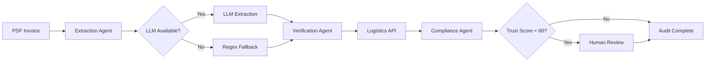

# GreenTrust AI 🌱

**Autonomous Multi-Agent ESG Scope 3 Auditor** with SEBI BRSR Compliance

[](https://www.python.org/downloads/)
[](https://github.com/astral-sh/uv)
[](https://opensource.org/licenses/MIT)

## 🚀 Quick Start (Modern Setup with uv)

### 1. Install uv (One-Time Setup)

**Windows:**
```powershell
powershell -c "irm https://astral.sh/uv/install.ps1 | iex"
```

**macOS/Linux:**
```bash
curl -LsSf https://astral.sh/uv/install.sh | sh
```

### 2. Install Project

```bash
# Clone repository
git clone https://github.com/adity0208/GreenTrust_Ai
cd GreenTrust_Ai

# Install with uv (⚡ 10-100x faster than pip)
uv pip install -e .

# Configure API key
cp .env.example .env
# Edit .env and add your OPENAI_API_KEY
```

### 3. Generate Sample Data

```bash
python generate_pdfs.py
python generate_edge_cases.py
```

### 4. Run Dashboard

```bash
streamlit run app.py
```

Open http://localhost:8501 in your browser! 🎉

## ✨ Features

### Competition-Grade Capabilities

- 🤖 **Multi-Agent Architecture** - Extraction → Verification → Compliance → Human Review
- 🔄 **Intelligent Fallback** - Automatic regex extraction when LLM quota exceeded (zero downtime)
- 📊 **Visual Dashboard** - Real-time agent thinking with Trust Score gauge
- ✅ **SEBI BRSR Compliant** - Principle 6 Question 2 validation
- 🌍 **Edge Case Handling** - Missing dates, EUR currency, high-risk regions, multimodal transport, greenwashing detection
- 📈 **Trust Score** - 0-100 scoring with BRSR alignment
- 🧠 **Reasoning History** - Complete audit trail of all decisions
- 👤 **Human Review** - Automatic flagging for suspicious invoices

### Technical Highlights

- ⚡ **Modern Package Management** - Uses `uv` for 10-100x faster installations
- 🎯 **Type-Safe** - Pydantic v2 models throughout
- 🔍 **Transparent** - Every decision logged and explained
- 🛡️ **Resilient** - Never crashes, even with API failures
- 📦 **Modular** - Clean separation of agents, knowledge base, and utilities

## 📁 Project Structure

```
GreenTrust_Ai/
├── agents/                  # Multi-agent system
│   ├── extraction_agent.py  # PDF parsing + LLM/regex extraction
│   ├── verification_agent.py # Benchmark comparison
│   ├── compliance_agent.py  # SEBI BRSR evaluation
│   ├── workflow.py          # LangGraph orchestration
│   ├── state.py             # Pydantic state models
│   └── regex_extractor.py   # Fallback extraction
├── knowledge_base/          # Domain knowledge
│   ├── sebi_brsr_standards.md
│   └── logistics_api.py     # Mock emissions API
├── utils/                   # Utilities
│   ├── currency_converter.py
│   └── risk_assessment.py
├── evaluation/              # RAGAS framework
├── data_samples/            # Test invoices (7 PDFs)
├── app.py                   # Streamlit dashboard
├── main.py                  # CLI interface
├── config.py                # Configuration
├── pyproject.toml           # Modern package config
└── .env.example             # Environment template
```

## 🎯 Usage

### Dashboard (Recommended)

```bash
streamlit run app.py
```

Features:
- Upload PDFs or select samples
- Real-time agent thinking
- Trust Score gauge visualization
- Human review alerts
- JSON export

### Command Line

```bash
# Single invoice
python main.py --input data_samples/valid_invoice.pdf

# Batch processing
python main.py --input data_samples/ --batch

# Custom output directory
python main.py --input invoice.pdf --output results/
```

### Demo Mode (No API Key)

```bash
python run_demo.py
```

## 🧪 Sample Invoices

| File | Purpose | Expected Result |
|------|---------|-----------------|
| `valid_invoice.pdf` | Clean invoice | Trust Score ~78, BRSR aligned |
| `suspicious_invoice.pdf` | High deviation | Trust Score ~42, flagged for review |
| `edge_case_missing_date.pdf` | Missing date field | Tests fallback logic |
| `edge_case_eur_currency.pdf` | EUR currency | Tests conversion (EUR→INR) |
| `edge_case_high_risk_region.pdf` | Afghanistan route | Auto-flags for review |
| `edge_case_multimodal.pdf` | Air+road+sea | Multi-leg calculation |
| `edge_case_zero_emissions.pdf` | Carbon-neutral claim | Greenwashing detection |

## 🔧 Development

### Install with Dev Dependencies

```bash
uv pip install -e ".[dev]"
```

### Run Tests

```bash
pytest
```

### Code Quality

```bash
# Format code
black .

# Lint
ruff check .

# Type check
mypy .
```

## 📊 Architecture



## 🏆 Competition Features

1. **Zero Downtime** - Intelligent fallback ensures demos never fail
2. **Visual Excellence** - Professional Streamlit dashboard with gauge charts
3. **SEBI Compliance** - Explicit Principle 6 Question 2 validation
4. **Edge Cases** - Comprehensive handling of real-world scenarios
5. **Modern Tooling** - Uses `uv` for fast, reliable package management
6. **Transparency** - Complete reasoning history for every decision

## 📝 Configuration

Edit `.env`:

```bash
OPENAI_API_KEY=sk-your-key-here
LLM_MODEL=gpt-4o
LLM_TEMPERATURE=0.0
LOG_LEVEL=INFO
```

## 🤝 Contributing

This is a competition project. For production use, consider:

- Real logistics APIs (replace mock)
- Database integration (PostgreSQL/MongoDB)
- User authentication
- Cloud deployment (Docker + AWS/GCP)
- Continuous monitoring

## 📄 License

MIT License - See LICENSE file for details

## 🙏 Acknowledgments

- Built with LangGraph, LangChain, and OpenAI
- SEBI BRSR framework compliance
- Modern package management with `uv`

---

**Made with ❤️ for ESG Compliance**
